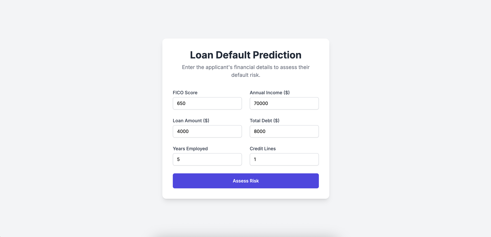

# End-to-End MLOps: Loan Default Prediction

This project demonstrates a complete, end-to-end MLOps workflow for building, deploying, and automating a machine learning model. The objective is to predict the probability of a customer defaulting on a personal loan, using a Flask web application deployed on AWS.

The entire process is automated via a CI/CD pipeline, ensuring that any new code pushed to the main branch is automatically tested, built, and deployed to a live environment.



## MLOps Features Implemented

This project showcases several core MLOps practices:

- Version Control: The entire project is version-controlled using Git, with a clear commit history tracking every change.

- Experiment Tracking: All model training runs are meticulously logged and managed using MLflow, allowing for easy comparison and selection of the best model.

- Containerization: The Flask application is packaged into a portable and reproducible Docker image, encapsulating the code, model, and all dependencies.

- Continuous Integration & Continuous Deployment (CI/CD): An automated GitHub Actions pipeline handles the entire workflow:

- CI: Installs dependencies, runs data processing and training scripts to generate model artifacts.

- CD: Builds a Docker image, pushes it to Amazon ECR, and deploys it as a live service on Amazon ECS (Fargate).

- Cloud Deployment: The final application is deployed on AWS, making it accessible via a public URL.

## Project Structure

├── .github/workflows/      # Contains the GitHub Actions CI/CD pipeline (main.yml)
├── data/
│   ├── processed/          # Processed data (X_train, y_train, etc.) - Ignored by Git
│   └── loan_deafult.csv    # The raw dataset
├── docs/
│   └── images/             # Screenshots for the final presentation
├── models/                 # The final trained model artifact (model.pkl) - Ignored by Git
├── notebooks/              # Jupyter notebooks for EDA and experimentation
├── processors/             # The saved data scaler (scaler.joblib) - Ignored by Git
├── src/
│   ├── data_processing.py  # Script to clean data and create features
│   └── train.py            # Script to train models and log with MLflow
├── templates/
│   └── index.html          # HTML template for the Flask app UI
├── app.py                  # The Flask web application
├── Dockerfile              # Instructions to build the application's Docker image
├── requirements.txt        # Python dependencies
└── README.md               # This file

## How to Run This Project

#### Prerequisites

- Python 3.9+

- Docker Desktop

- An AWS account with the AWS CLI configured

### 1. Local Setup

1.  **Clone the repository:**

    ```bash
    git clone [https://github.com/adamfaik/loan-default-prediction](https://github.com/adamfaik/loan-default-prediction)
    cd loan-default-prediction
    ```

2.  **Create and activate a virtual environment:**

    ```bash
    python3 -m venv venv
    source venv/bin/activate
    ```

3.  **Install dependencies:**

    ```bash
    pip install -r requirements.txt
    ```

### 2. Running the Key Scripts

1.  **Process the data:**

    This script will generate the cleaned and scaled data in the `data/processed/` folder and the `scaler.joblib` file.
    ```bash
    python src/data_processing.py
    ```

2.  **Train the models:**

    First, launch the MLflow UI in a separate terminal:

    ```bash
    mlflow ui
    ```

    Then, run the training script. This will create the `mlruns/` directory and log all experiments.

    ```bash
    python src/train.py
    ```

    You can view the results at `http://127.0.0.1:5000`.

### 3. Running the Application

There are two ways to run the web application:

**A. Locally with Flask:**

This requires you to manually copy the best `model.pkl` from the `mlruns` directory into the `models/` folder.

```bash
# Launch the local Flask server
python app.py
```

The app will be available at `http://127.0.0.1:5001`.

**B. Using Docker (Recommended):**

This method simulates the production environment.

```bash
# 1. Build the Docker image
docker build -t loan-default-app .

# 2. Run the container
docker run -p 5000:5001 loan-default-app
```

The app will be available at `http://localhost:5000`.

## CI/CD Pipeline

The CI/CD pipeline is defined in `.github/workflows/main.yml`. It is triggered on every `push` to the `main` branch and performs the following jobs:

1. `ci` **(Build, Test, and Create Artifacts)**:

    - Installs dependencies.

    - Runs the data processing and training scripts to generate the `scaler.joblib` and `model.pkl` files.

    - Uploads all necessary application files as a shareable artifact.

2. `cd` **(Deploy to AWS ECS)**:

    - Downloads the artifacts from the `ci` job.

    - Builds a Docker image.

    - Pushes the image to a private repository in Amazon ECR.

    - Deploys a new revision of the application to a running service on Amazon ECS (Fargate).

To use this pipeline, the following secrets must be configured in the GitHub repository's `Settings > Secrets and variables > Actions`:

- `AWS_ACCESS_KEY_ID`

- `AWS_SECRET_ACCESS_KEY`

- `ECS_CLUSTER`

- `ECS_SERVICE`

- `ECS_TASK_DEFINITION`